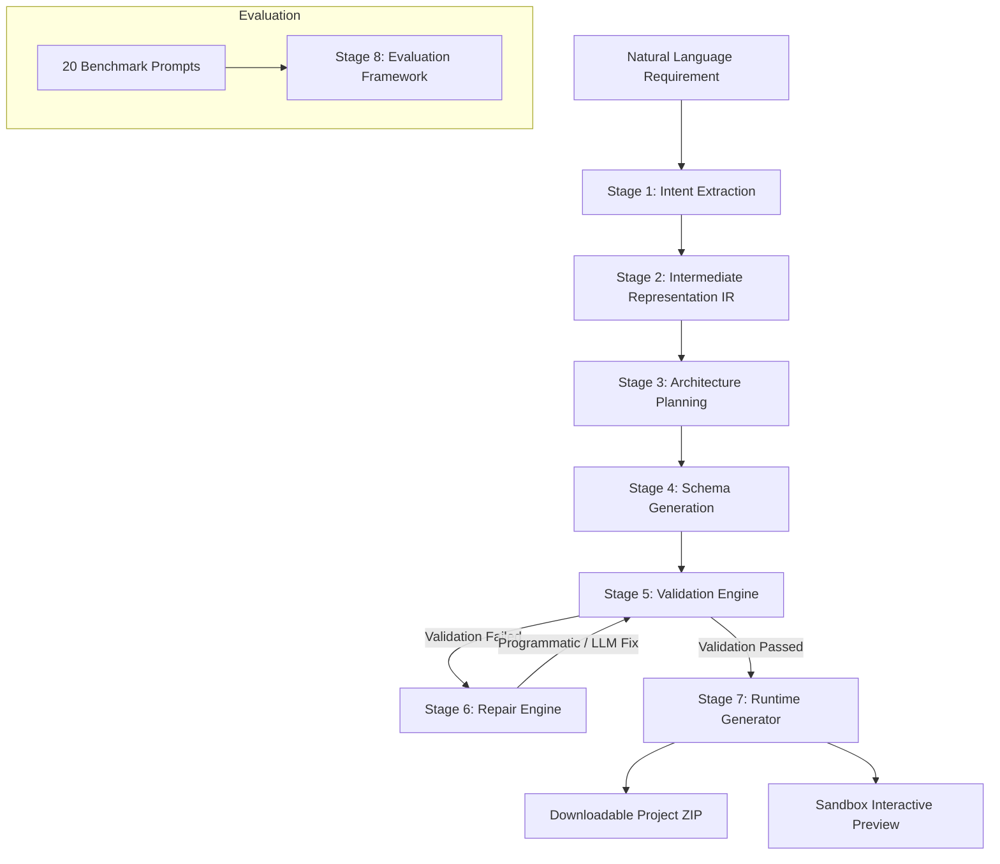

# AppForge AI — Natural Language to Application Compiler

AppForge AI is a production-quality full-stack platform that operates as a software compiler. Instead of functioning as a chat interface, AppForge compiles natural language software requirements into intermediate representations, plans database schemas and microservice dependency DAGs, designs visual layouts, programmatically validates cross-layer constraints, repairs schema inconsistencies using an LLM feedback loop, and synthesizes an executable application package (ZIP).

---

## Compiler Architecture

The application compiler is designed around an 8-stage pipeline:



### Stage 1: Intent Extraction
Converts natural language input into high-level features and roles. 
- *Vague Requirement Handling:* Flags status as `needs_clarification` and generates clarification questions.
- *Conflicting Requirement Handling:* Identifies contradictions (e.g. "no login but users must have profiles") and yields a conflict report.

### Stage 2: Intermediate Representation (IR)
Synthesizes intent into a strict Intermediate Representation defining database entities, pages router views, and service dependencies. This IR acts as the single source of truth for all downstream compiler stages.

### Stage 3: Architecture Planning
Constructs domain entity relationships (one-to-many, many-to-one, etc.), sequence steps for key user flows, and service call DAGs.

### Stage 4: Schema Generation
Generates five distinct schema sheets:
1. **UI Schema:** Route coordinates, component names, forms, charts, tables, and buttons.
2. **API Schema:** REST endpoints, request/response body schemas, and descriptions.
3. **Database Schema:** Tables, columns, keys, types, and constraints.
4. **Auth Schema:** Secure path permissions and user roles.
5. **Business Logic Schema:** Validation triggers and constraints.

### Stage 5: Validation Engine
Executes programmatic cross-layer consistency verification rules:
- Forms submit fields matching corresponding API schemas.
- Endpoint parameters map to DB table column definitions.
- Endpoint path resources map to existing database tables.
- Page layouts align with registered backend service namespaces.

### Stage 6: Repair Engine
If validation fails, the Repair Engine runs a correction loop:
- In mock mode: deterministically patches schema attributes.
- In Gemini mode: queries Gemini with temperature 0 to correct *only* the failed blocks, feeding the output back into the validator.

### Stage 7: Runtime Generator
Translates schemas into executable source files:
- **FastAPI:** Router code, model bindings, security filters, JWT handlers, and role check decorators.
- **Next.js:** Interface views, stats widgets, data tables, forms with local simulated DB state, and navigation components.
- **PostgreSQL DDL:** Schema script.
Packages the workspace into a downloadable ZIP archive.

### Stage 8: Evaluation Framework
Preloaded with 10 Normal prompts (CRM, ERP, LMS, Fintech, etc.) and 10 Edge cases. Tracks latency breakdowns, token counts, and success rates.

---

## Technical Stack

- **Backend:** FastAPI (Python 3.12+), Pydantic, SQLAlchemy, Jinja2, Pytest
- **Frontend:** Next.js 15 (App Router), TypeScript, TailwindCSS, `@xyflow/react` (React Flow), Lucide React
- **AI Model:** Gemini 2.5 Pro API

---

## Project Structure

```
AppForge/
├── backend/
│   ├── app/
│   │   ├── main.py              # Server entrypoint & routing
│   │   ├── config.py            # Environment & fallback settings
│   │   ├── schemas.py           # Pydantic compiler models
│   │   ├── pipeline/            # 8 Pipeline Stages
│   │   │   ├── stage1_intent.py
│   │   │   ├── stage2_ir.py
│   │   │   ├── stage3_architecture.py
│   │   │   ├── stage4_schema.py
│   │   │   ├── stage5_validator.py
│   │   │   ├── stage6_repair.py
│   │   │   ├── stage7_runtime.py
│   │   │   └── stage8_evaluation.py
│   │   ├── services/
│   │   │   ├── gemini.py        # Gemini client & Mock fallback engine
│   │   │   └── zip_generator.py # In-memory ZIP package synthesizer
│   │   └── test/
│   │       └── test_pipeline.py # Pytest suite
│   ├── requirements.txt         # Backend python packages
│   └── static/                  # Downloads repository
├── frontend/
│   ├── app/                     # Page views
│   │   ├── page.tsx             # Compiler workspace
│   │   ├── dashboard/page.tsx   # Benchmarks metrics panel
│   │   ├── layout.tsx           # Global wrapper & SEO tags
│   │   └── globals.css          # Glassmorphic stylesheet
│   ├── components/              # Widgets
│   │   ├── PipelineFlow.tsx     # React Flow pipeline visualizer
│   │   ├── CodeExplorer.tsx     # File tree explorer & code reader
│   │   └── AppPreview.tsx       # Dynamic preview sandbox
│   └── package.json             # NPM package list
└── README.md                    # System documentation
```

---

## Quick Start Setup

### 1. Backend Server Setup
1. Open terminal and navigate to the backend folder:
   ```bash
   cd backend
   ```
2. Create and activate a Python virtual environment:
   ```bash
   python -m venv .venv
   # Windows:
   .\.venv\Scripts\activate
   # Linux/macOS:
   source .venv/bin/activate
   ```
3. Install dependencies:
   ```bash
   pip install -r requirements.txt
   ```
4. Run the FastAPI development server:
   ```bash
   python -m uvicorn app.main:app --host 127.0.0.1 --port 8000 --reload
   ```

### 2. Frontend Development Server Setup
1. Open a new terminal and navigate to the frontend folder:
   ```bash
   cd frontend
   ```
2. Install npm packages:
   ```bash
   npm install
   ```
3. Start the Next.js development server:
   ```bash
   npm run dev
   ```
4. Open [http://localhost:3000](http://localhost:3000) in your web browser.

### 3. API Key Configuration
By default, the platform runs in **Mock Fallback Mode** which allows full testing, UI previews, and zip generation without any external API keys.
To connect to the live Gemini API:
1. Create a `.env` file in the `backend/` folder:
   ```env
   GEMINI_API_KEY=your_actual_gemini_api_key_here
   ```
2. Open settings inside the top-right header drawer of the AppForge workspace UI and untick the **Force Mock Fallback Mode** checkbox.

### 4. Running Backend Verification Tests
To run the Pytest verification suite:
```bash
cd backend
.\.venv\Scripts\pytest
```
